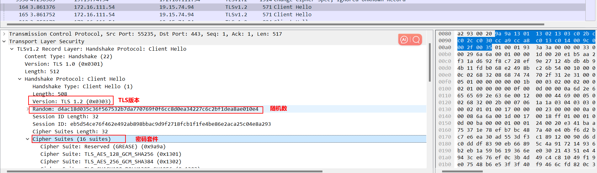
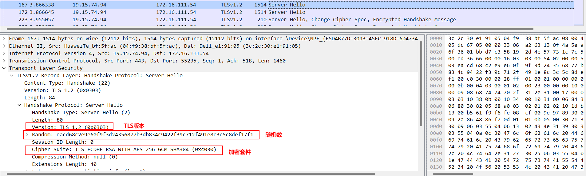
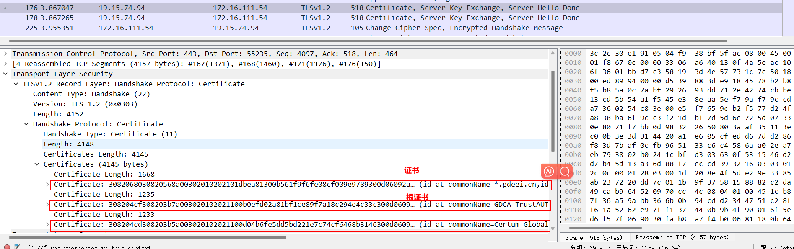
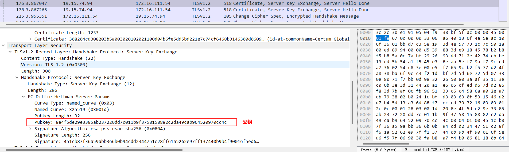
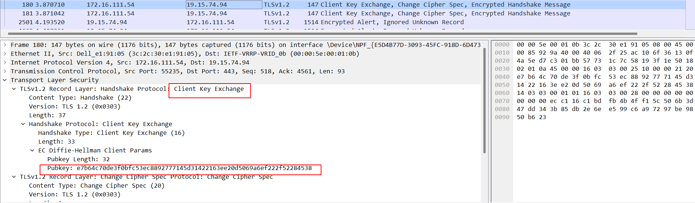
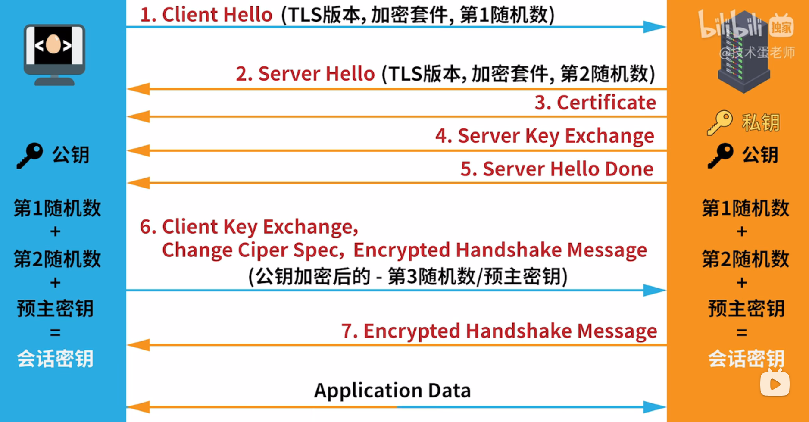

## 1.简介

TLS 协议在 TCP/IP 体系中的传输层和应用层之间工作,通过提供机密性、完整性、必选的服务器认证以 及可选的客户端认证等一系列安全服务,有效保护了传输层的安全 。

TLS1.2于2008年发布，提供更高的安全性，并为提高性能和增强可靠性而设计。为了实现这一点，它依赖于对称和不对称加密算法的组合。更具体地说，TLS1.2用单个哈希散列替换了数字签名元素中的MD5/SHA-1组合，确保提高握手过程中协商的安全性。同时，它还提供了对客户端和服务器为散列和签名指定算法的能力的改进。TLS1.2还支持增强的身份验证加密，并添加TLS扩展和AES密码套件。

1.Client Hello

客户端向服务器请求，客户端与服务器打招呼，告诉服务器他支持tls的版本和加密套件

2.Server Hello

服务器收到请求后进行响应，服务器告诉客户端确定支持的TLS版本和加密套件

3.Certificate, Server Key Exchange, Server HeIIo Done

Certificate：服务器继续响应发送服务器自己的证书，这样浏览器就可以根据对照自己的证书信任列表来确认这个服务器是否可靠。

Server Key Exchange：服务器接下来继续响应发送公钥给客户端。

Server HeIIo Done：服务器告诉客户端响应完成。

4.Client Key Exchange,Change Cipher Spec, Encrypted Handshake message

Client Key Exchange：客户端对服务器响应的回应，生成第三个随机数，也叫预主密钥，这个预主密钥会用刚刚收到的公钥进行加密，然后把加密后的随机数发给服务器，这是数正是下图的`Pubkey`。

Change Cipher Spec：客户端告诉服务器之后的数据就用商议好的算法和密钥来加密。

Encrypted Handshake message：表示客户端的TLS协商已经没问题，加密开始。

5.Encrypted Handshake message：服务器表示也准备好了，表示TLS的握手已经成功，可以给数据加密进行交换。

