## 1.登录云服务器

在购买ECS服务器后，系统会创建一个ECS实例。每一个ECS实例对应一台已购买的云服务器。您可以通过电脑上自带的终端工具访问云服务器，进行应用部署和环境搭建。

1. 在左侧导航栏，选择**实例与镜像>实例**。
2. 在顶部菜单栏左上角处，选择实例的所属地域。
3. 在**实例**页面，找到目标实例，在操作列单击 **> 实例属性>重置实例密码**，按照界面提示设置ECS实例的登录密码。保存密码后，在弹出的页面，单击**立即重启**使密码生效。

**说明：**实例创建完成大约3~5分钟后，才支持重置实例密码，如不可重置请耐心等待后重试

4. 单击实例的ID，选择**安全组**页签，单击安全组**操作**列的**配置规则**，在入方向添加需要放行的端口。本教程中，在安全组入方向放行SSH默认22端口、Apache默认80端口。
5. 远程连接ECS实例。可以使用`MobaXterm`软件管理。

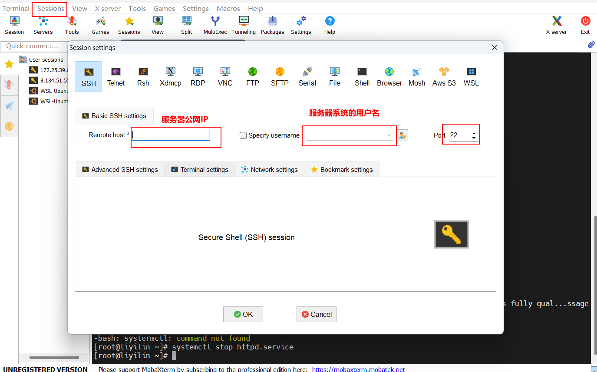

## 2.部署LAMP环境

L为Linux，A为Apache，M为MySQL，P为PHP

1. 在ECS服务器上，执行以下命令，安装Apache服务及其扩展包。

```
yum -y install httpd httpd-manual mod_ssl mod_perl
```

如果回显信息显示Complete!，则表示Apache安装成功。

2. 执行以下命令，启动Apache服务。

```
systemctl start httpd.service
```

3. 打开浏览器输入ECS服务器的公网IP，如果显示如下图的测试页面表示Apache服务安装成功。


4. 参考以下操作在ECS服务器上搭建一个MySQL数据库。

执行以下命令，下载并安装MySQL。

```
wget http://dev.mysql.com/get/mysql57-community-release-el7-10.noarch.rpm
yum -y install mysql57-community-release-el7-10.noarch.rpm
yum -y install mysql-community-server --nogpgcheck
```

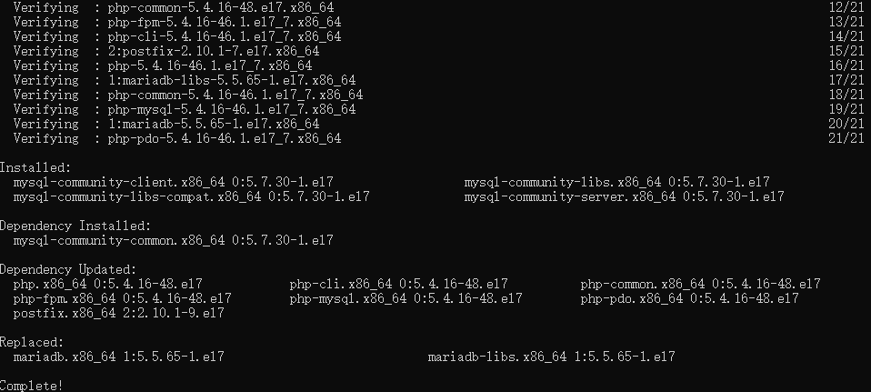

执行以下命令，启动MySQL数据库。

```
systemctl start mysqld.service
```

执行以下命令，查看MySQL运行状态。

```
systemctl status mysqld.service
```

执行以下命令，查看MySQL初始密码。

```
grep "password" /var/log/mysqld.log
```

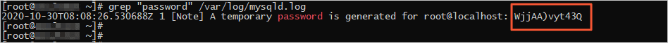

 执行以下命令，登录数据库。

```
mysql -uroot -p
```

执行以下命令，修改MySQL默认密码。您需要将下面命令中的NewPassWord1.修改为您要设置的数据库密码。新密码设置的时候如果设置的过于简单会报错，必须同时包含大小写英文字母、数字和特殊符号中的三类字符。

```
ALTER USER 'root'@'localhost' IDENTIFIED BY 'NewPassWord1.';
```

执行以下命令，创建一个存储博客网站内容的数据库。

```
create database wordpress; 
```

执行以下命令，查看是否创建成功。

```
show databases;
```

输入exit退出数据库。

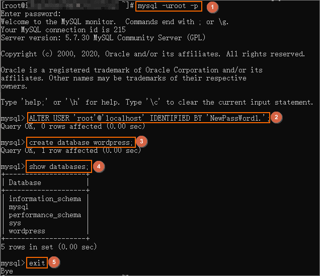

5. WordPress是使用PHP语言开发的博客平台。参考以下操作安装PHP。

执行以下命令，安装PHP。

```
yum -y install php php-mysql gd php-gd gd-devel php-xml php-common php-mbstring php-ldap php-pear php-xmlrpc php-imap
```

执行以下命令，创建PHP测试页面。

```
echo "<?php phpinfo(); ?>" > /var/www/html/phpinfo.php
```

执行以下命令，重启Apache服务。

```
systemctl restart httpd
```

 打开浏览器，访问http://<ECS公网IP>/phpinfo.php，显示如下页面表示PHP安装成功。

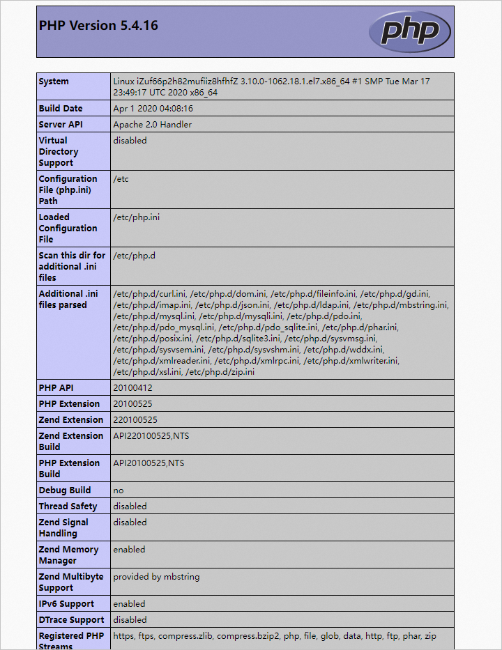

## 3. 安装和配置WordPress

完成上述环境搭建后，参考以下操作安装WordPress。

执行以下命令，安装WordPress。

```
yum -y install wordpress
```

显示如下信息表示安装成功。

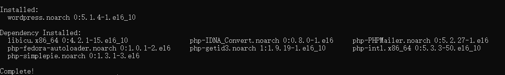

修改WordPress配置文件。

执行以下命令，修改wp-config.php指向路径为绝对路径。

```
# 进入/usr/share/wordpress目录。
cd /usr/share/wordpress
# 修改路径。
ln -snf /etc/wordpress/wp-config.php wp-config.php
# 查看修改后的目录结构。
ll
```

执行以下命令，移动WordPress到Apache根目录。

```
# 在Apache的根目录/var/www/html下，创建一个wp-blog文件夹。
mkdir /var/www/html/wp-blog
mv * /var/www/html/wp-blog/
```

执行以下命令，修改wp-config.php配置文件。

database_name_here为之前步骤中创建的数据库名称，本示例为wordpress。

username_here为MySQL数据库的用户名，本示例为root。

password_here为MySQL数据库的登录密码，本示例为NewPassWord1.。

```
sed -i 's/database_name_here/wordpress/' /var/www/html/wp-blog/wp-config.php
sed -i 's/username_here/root/' /var/www/html/wp-blog/wp-config.php
sed -i 's/password_here/NewPassWord1./' /var/www/html/wp-blog/wp-config.php
```

执行以下命令，查看配置文件信息是否修改成功。

```
cat -n /var/www/html/wp-blog/wp-config.php
```

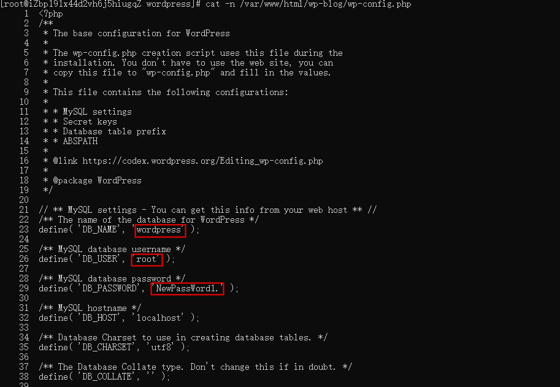

执行以下命令，重启Apache服务。

```
systemctl restart httpd
```

## 4. 发布博客

完成WordPress安装后，参考以下操作创建个人站点并发布内容。

1. 打开浏览器并访问http://<ECS公网IP>/wp-blog/wp-admin/install.php。

2. 设置您的站点名称、管理员用户名和密码，然后单击Install WordPress完成WordPress初始化。

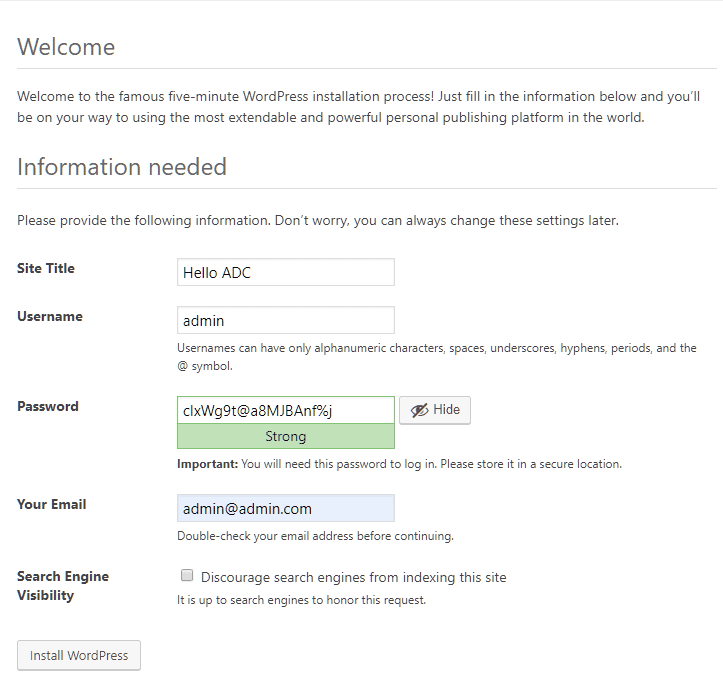

3. 单击 Log In ，输入用户名和密码，然后再次单击Log In打开WordPress站点。

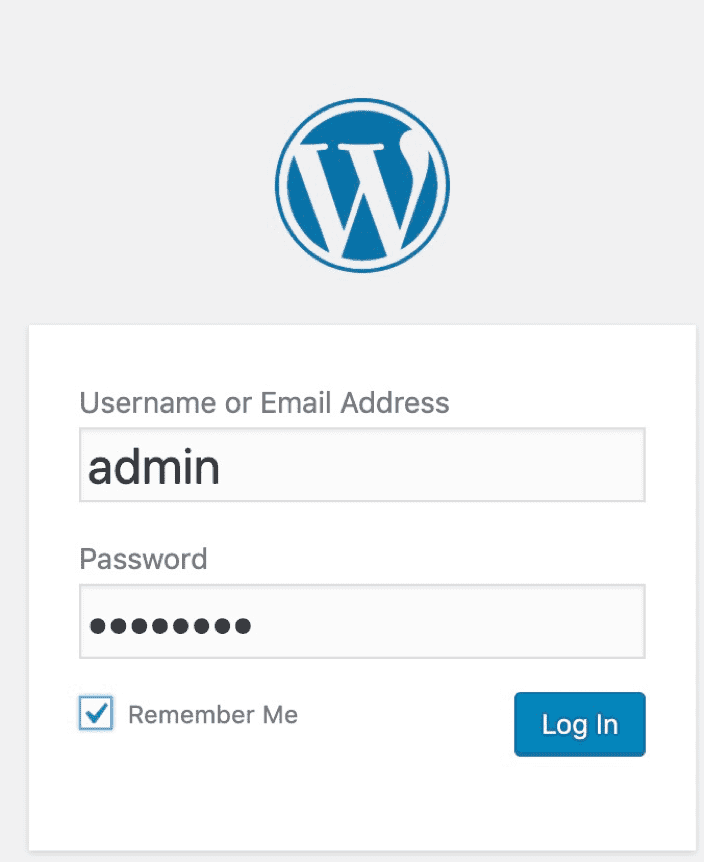

登录后，您就可以根据需要创建内容进行发布了。至此您已完成WordPress的搭建。

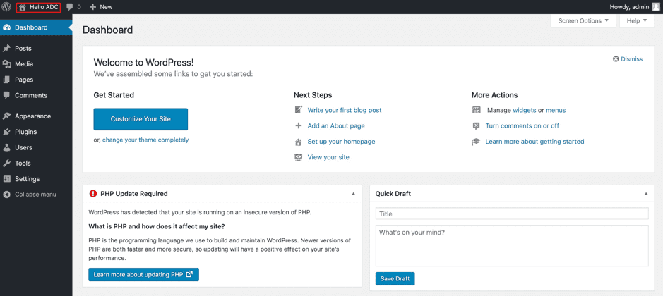

4. 您可以单击Write your first blog post，开始编写您的第一篇博客。

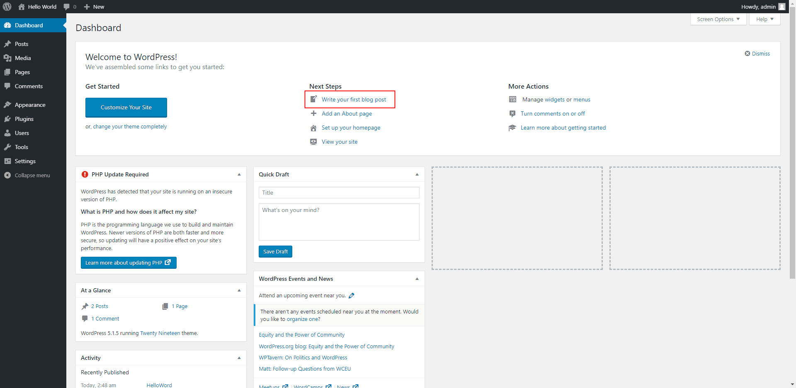