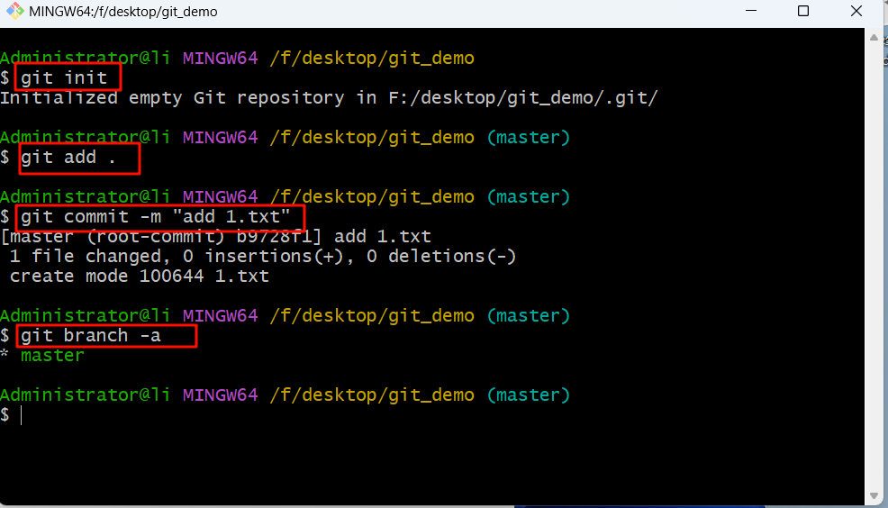
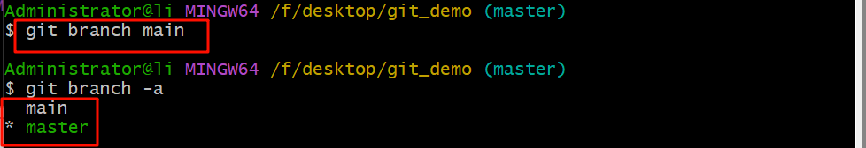
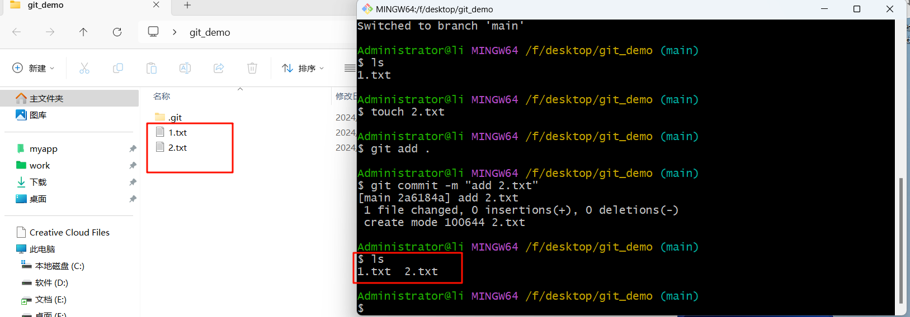
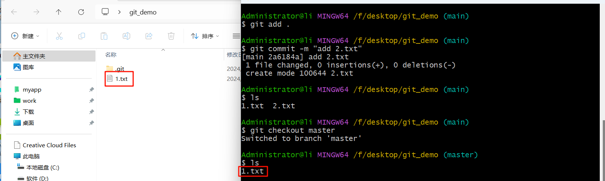
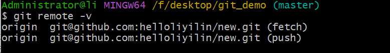
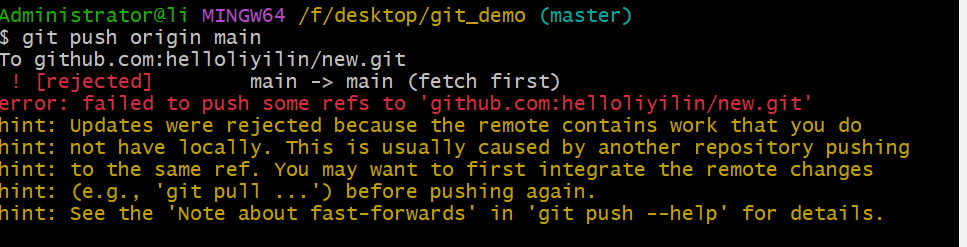
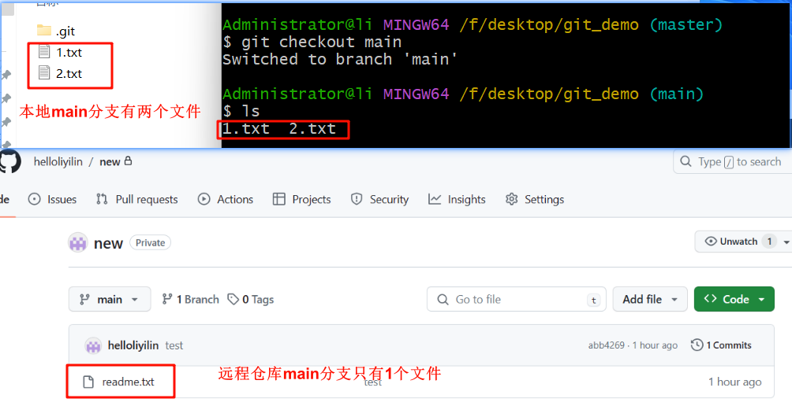

## 1. git本地仓库

我们在本地创建一个项目，在该项目的目录下右键`Git Bash Here`。执行命令`git init`，该命令的主要作用是在指定的目录中创建一个新的Git仓库。当前目录下会自动生成一个名为.git的隐藏文件夹，这个隐藏的文件夹就是Git版本库。

```
git init
```

在目录下新建一个文件并且执行以下命令，才项目就会有默认的master分支。

```
git add .					//将当前目录下的所有修改（包括新创建的文件）添加到Git的暂存区。
git commit -m "提交信息"	//将暂存区中的修改提交到Git仓库
```

查看当前分支。

```
git branch -a		//-a参数表示显示所有分支
```



创建一个新的分支main。

```
git branch main
```

现在有两个分支了，`*master`表示当前工作在master分支。



我们现在可以进行切换分支，每次切换分支前记得要执行`git add .`和`git commit -m "提交信息"`命令。

```
git checkout main
```

切换成功后，我们创建一个2.txt文件，并且把文件提交到git仓库。

```
touch 2.txt
git add .
git commit -m "提交信息"
```

我们发现main分支有两个文件，1.txt和2.txt。



如果我们此时在切换回去master分支，那么只有1.txt文件，也就是说两个分支是独立的。

```
git checkout master
ls
```




## 2. git远程仓库

在github创建一个远程仓库，然后将本地的Git仓库与远程的Git仓库进行关联。git@github.com:helloliyilin/new.git是远程仓库的URL地址，使用SSH协议进行连接。

```
git remote add origin git@github.com:helloliyilin/new.git	//本地仓库与远程仓库关联
```

显示与本地仓库关联的远程仓库的详细信息。

```
git remote -v
```



现在可以把本地仓库推送到GitHub的远程仓库了。

```
git push origin main	//origin表示远程仓库的名称，main是要推送的本地分支的名称
```

推送的时候发现问题，推送不上去远程仓库



这个原因是由于我远程仓库中存在一些你本地没有的更改，因此无法直接推送。这种情况通常发生在两个不同的仓库试图推送到相同的引用（ref）上。这可能是由于其他仓库已经进行了更新并推送了这些更改，而你的本地仓库尚未获取这些更改。



1.首先，确保你已经获取了远程仓库的所有更改。可以使用`git pull`命令来拉取远程仓库的最新更改。例如，如果你想要拉取名为`origin`的远程仓库，可以运行以下命令：

```
git pull origin main		//拉取远程仓库的最新更改合并本地文件
```

这将从远程仓库获取最新的更改并将其合并到你的本地主分支上。

2.如果远程仓库中的更改与你本地的更改冲突，你需要解决这些冲突。这可以通过手动编辑文件或使用版本控制系统（如Git）来解决冲突。解决冲突后，保存更改并提交。

当然了我们现在只是作为演示，我们也可以强制把本地仓库。

```
git push -f origin main		//-f参数表示强制推送
```


