## 1. har文件验签

HAR文件，全称HTTP Archive，是一种专门用于储存HTTP请求和响应信息的通用文件格式，这种格式基于JSON。HAR文件可以捕获并记录所有HTTP请求和响应的详细信息，包括请求URL、请求方法、请求头、请求体、响应状态码、响应头和响应体等。

### 1.1. har文件放浏览器解析

在浏览器地址栏输入：about:blank，然后右键`检查`，点击`网络`按钮，把har文件加载到浏览器进行解析。

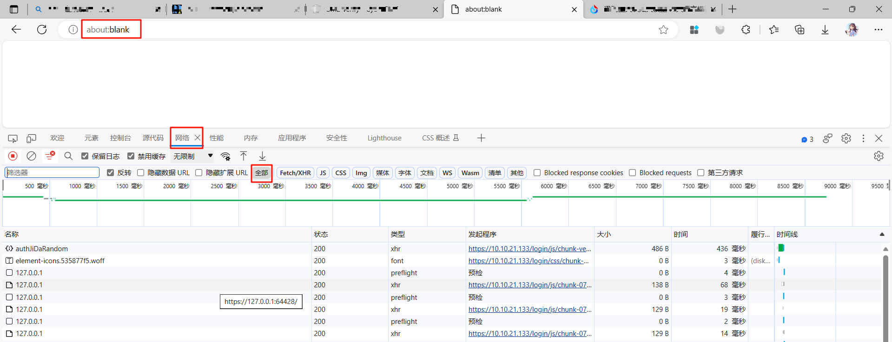

找到其中一个文件。“负载”中的**strValue**的值表示随机数，“预览”中的**value**的值表示公钥和签名值的解析值。

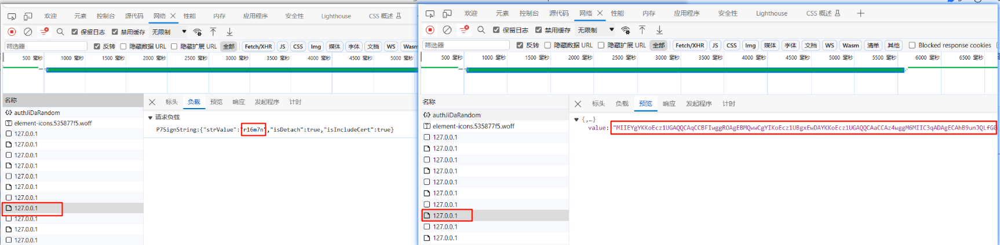

或者有可能遇到的随机数**random_id**和解析值**encrypted_data**，如下图所示。

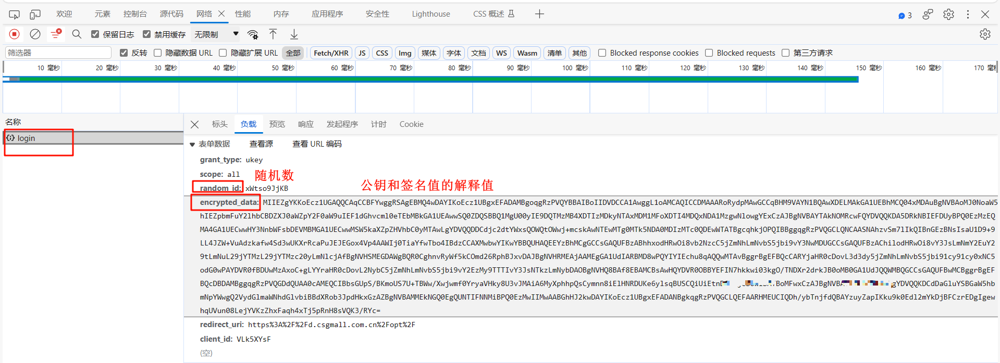

### 1.2解析值提取公钥和签名值

value的解释值需要在网站[ASN.1 JavaScript decoder](https://lapo.it/asn1js/)进行解析。打开网站默认界面如下图，把解析值粘贴进输入框，点击“decode”按钮。

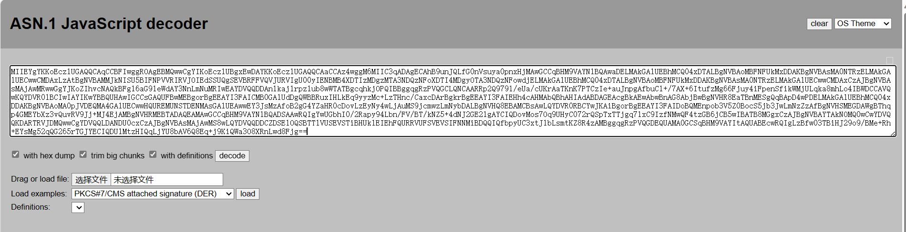

公钥值

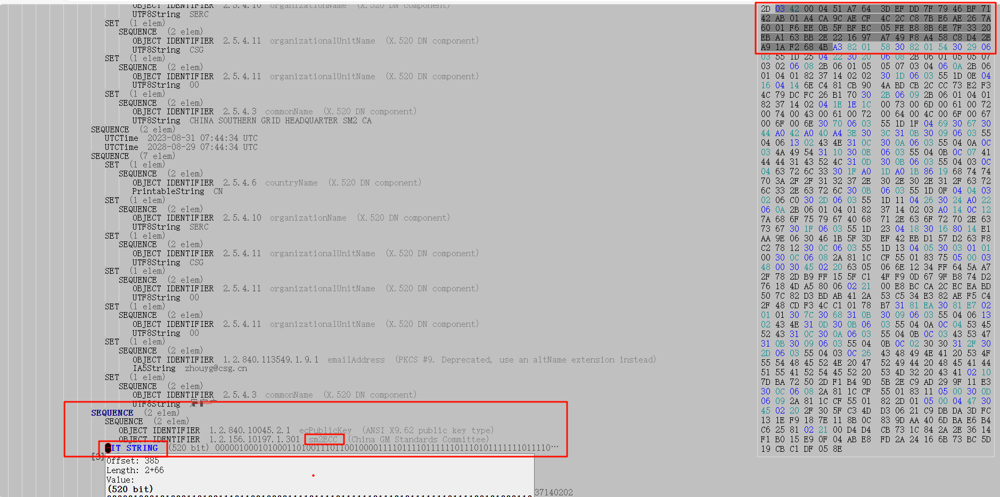

签名值

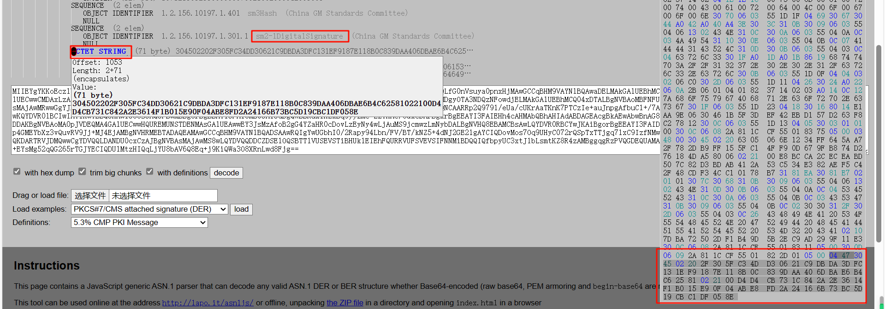

### 1.3 签名验证

根据ans.1的编码规则需要把前2个字节删除，第3个字节如果是00也要删除。第1个字节表示数据类型，第2个字节表示后面的字节数，第3个字节如果值为00表示填充值。把处理后的随机数、公钥值和签名值放到网站进行解析。

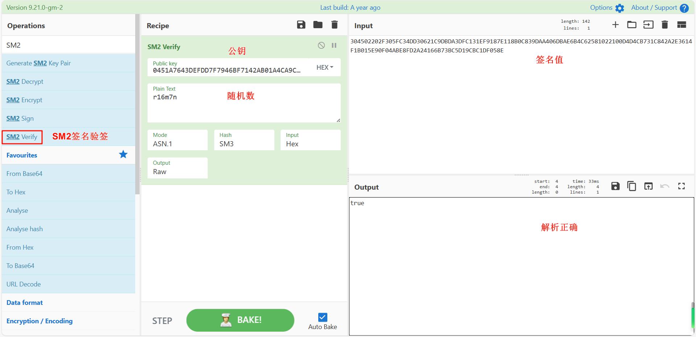

## 2. pcapng文件验签

### 2.1 wireshare解析文件

过滤http，找到POST。

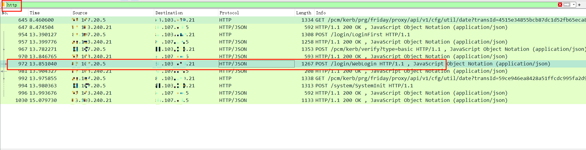

右键追踪流-HTTP流

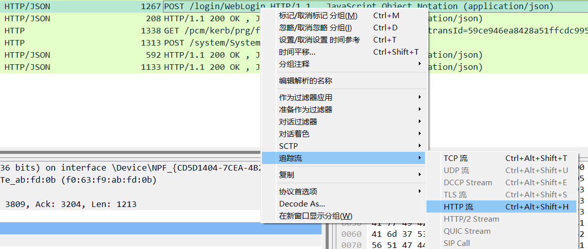

### 2.2 在HTTP流提取随机数、证书和签名值

找到随机数==random==。

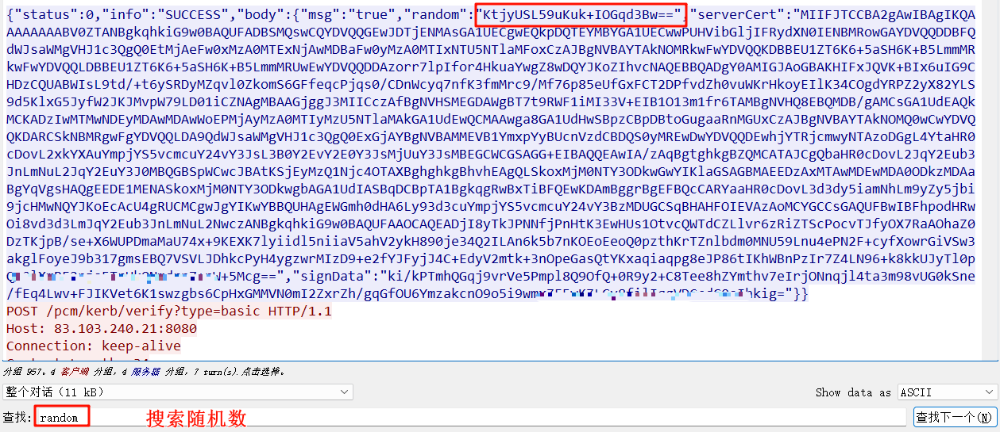

找到登录的证书`loginCert`和登录的签名值`loginSignedData`。

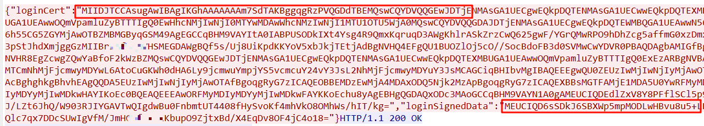

### 2.3 证书提取公钥

新建txt文件，把证书值复制到文件，重命名xx.cer，打开文件把公钥值提取出来，记得把空格删除。

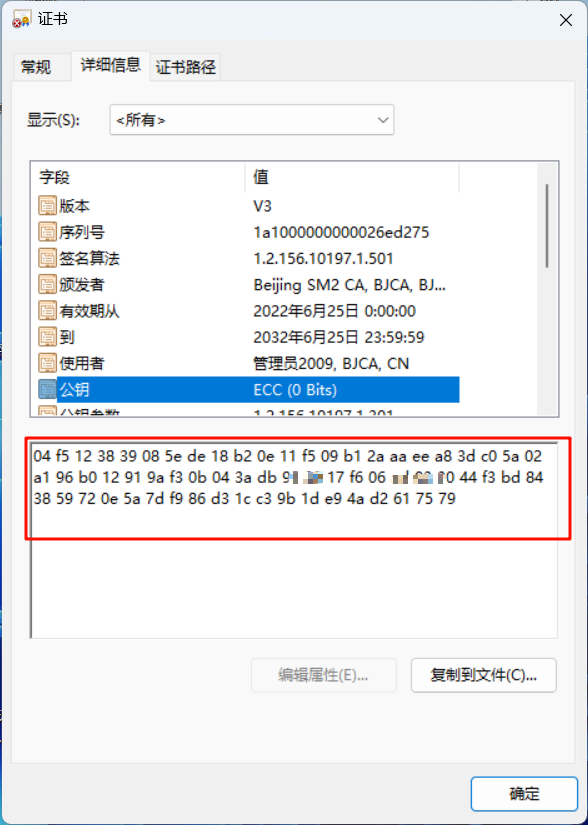

### 2.4 签名验签

签名值是以base64编码的，需要转换为hex形式。

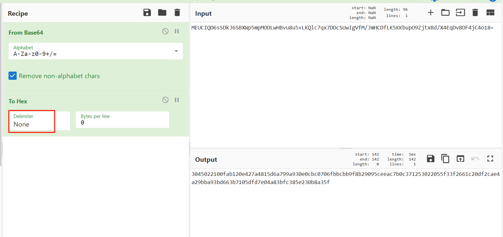

随机数、公钥和签名值解析验签。

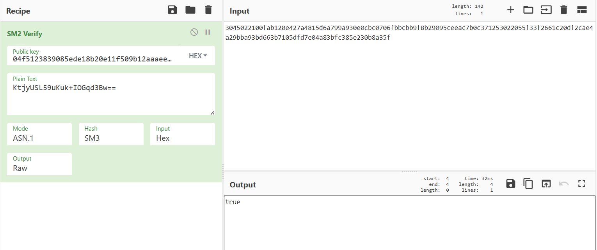

