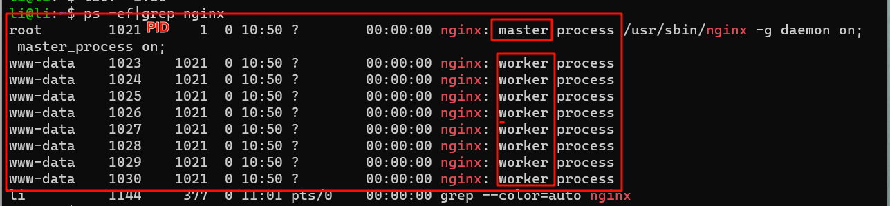
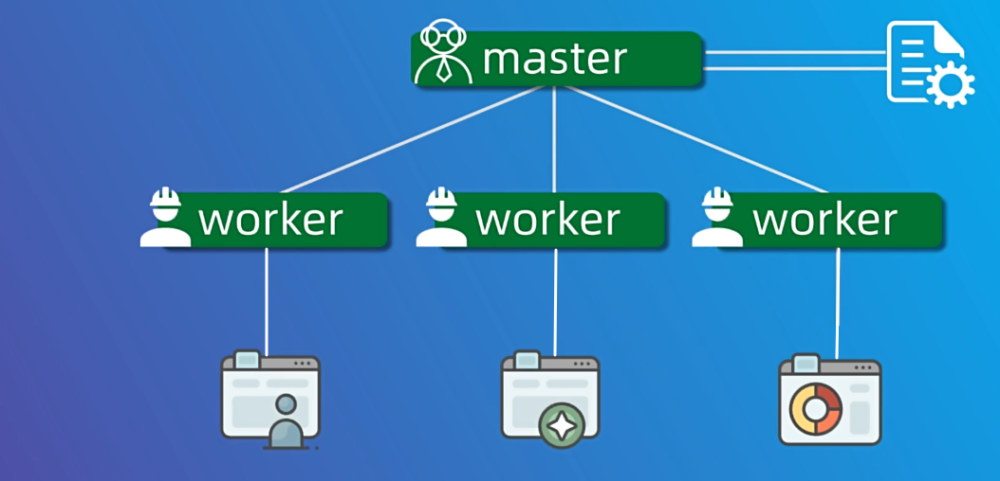
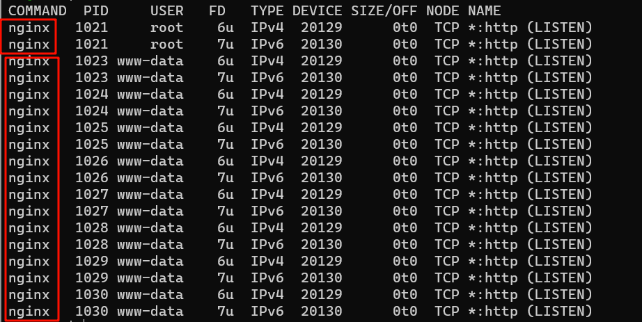
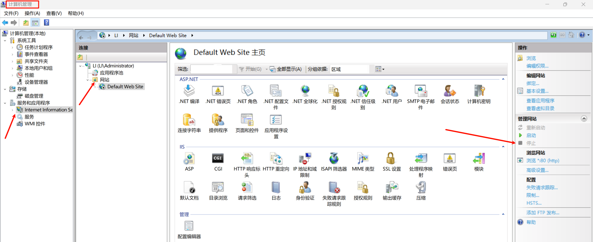
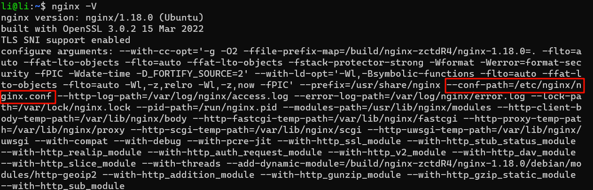

## 1. nginx的启动

我们在linux的ubuntu系统安装nginx可以用

```
sudo apt install nginx 
```

安装好启动nginx服务

```
sudo nginx
```

查看运行的进程

```
 ps -ef | grep nginx
```

nginx的进程可以分为master和worker进程。master进程就像公司的老板，老板只有一个，而worker进程就是公司的“打工人”，“打工人”肯定有很多的啦。worker进程数量可以通过配置文件来调整。





查看80端口被占用情况

```
sudo lsof -i:80
```



其实前面执行完`sudo ngnix`并且没有报错，那么你在浏览器输入`localhost`就能跳转到nginx的默认界面。但是不知道什么情况，我的电脑跳转到微软的IIS Windowns的界面，百度一下后把IIS服务关闭就可以了，如果还是跳转的IIS界面就清除一下浏览器的缓存。



这时候在浏览器输入`localhost`就能跳转到nginx的默认界面。


如果想停止nginx服务,可以执行

```
sudo nginx -s stop
```

或者优雅的停止，也不知道咋个优雅。

```
sudo nginx -s quit
```

我们如果对配置文件进行修改保存后需要执行重新配置文件的命令

```
sudo nginx -s reload
```

## 2. nginx静态网站部署

查看nginx的安装目录、编译参数以及配置文件和日志文件位置等各种信息。

```
nginx -V		//注意是大写的V
```

nginx的配置文件的位置，不同的linux版本可能位置补贴，以你查看到的为主。



还没写完（待续）

## 3. nginx卸载

我使用的是ubuntu的操作系统，用的是apt包管理进行下载，也用包管理进行卸载。

输入以下命令以停止nginx服务

```
sudo systemctl stop nginx
```

输入以下命令以卸载nginx

```
sudo apt-get remove nginx
```

输入以下命令以删除nginx配置文件和缓存文件：

```
sudo rm -rf /etc/nginx/var/lib/nginx
```

输入以下命令以删除nginx的依赖包：

```
sudo apt-get autoremove
```

## 4. 使用源码安装和使用

从官方网下载linux的源码，[nginx下载官网](https://nginx.org/en/download.html)，点击[ nginx-1.24.0](https://nginx.org/download/nginx-1.24.0.tar.gz) [pgp](https://nginx.org/download/nginx-1.24.0.tar.gz.asc)进行下载。下载完成把文件放到linux下的目录，我就放到家目录了。解压文件。

```
tar -zxvf nginx-1.24.0.tar.gz
```

解压后的文件为`nginx-1.24.0`，进入该目录执行预编译、编译、安装的过程。

```
yum install gcc gcc-c++ pcre  pcre-devel openssl openssl-devel zlib  zlib-devel -y    //安装源码编译以及Nginx依赖的库
cd nginx-1.24.0	//进入目录
./configure		//预编译
make			//编译
make install    //安装
```

