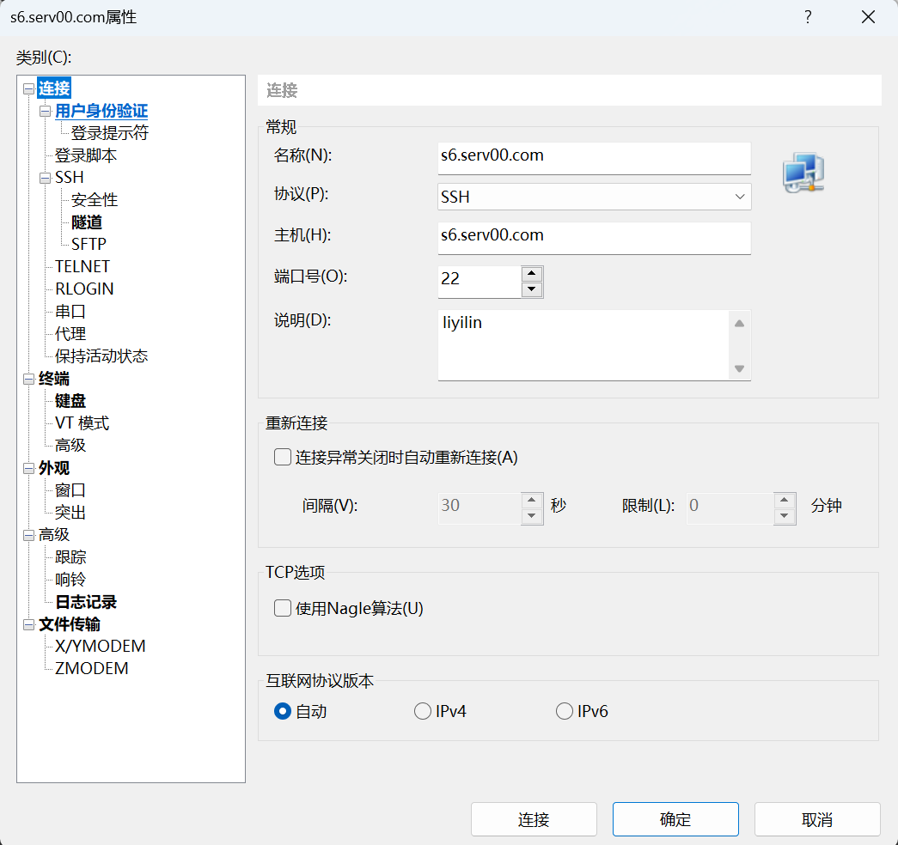

# 一、serv00服务器

## 1.1 SSH登录serv00服务器

主机（H）的`s6.serv00.com`可能用不了，可以使用`web6.serv00.com、cache6.serv00.com、pane6.serv00.com、panel6.serv00.net、liyilin.serv00.net`替换。



## 1.2 进入博客主路径

```shell
cd domains/liyilin.serv00.net/public_html
```

## 1.3 下载博客软件

下载typecho程序到目录

```shell
wget https://github.com/typecho/typecho/releases/latest/download/typecho.zip
```

## 1.4 解压文件

```shell
unzip typecho.zip
```

# 二、登录博客


安装过程中唯一难度就是这个**数据库信息**，首先**网页登录**serv00，创建数据库。


然后把数据库信息填入 typecho 安装界面


WEB界面：https://panel6.serv00.com

博客管理员控制台：https://liyilin.serv00.net


